# Sprawozdanie z zajęć laboratoryjnych nr 5
# Metodyki wytwarzania oprogramowania
# Sebastian Pietrykowski, 319085

## Wstęp
W ramach ćwiczenia skorzystałem z aplikacji frontendowej napisanej w Angularze 17, korzystającej z REST API napisanego w Java 17 w Springu. Strona przechowuje informacje o filmach.

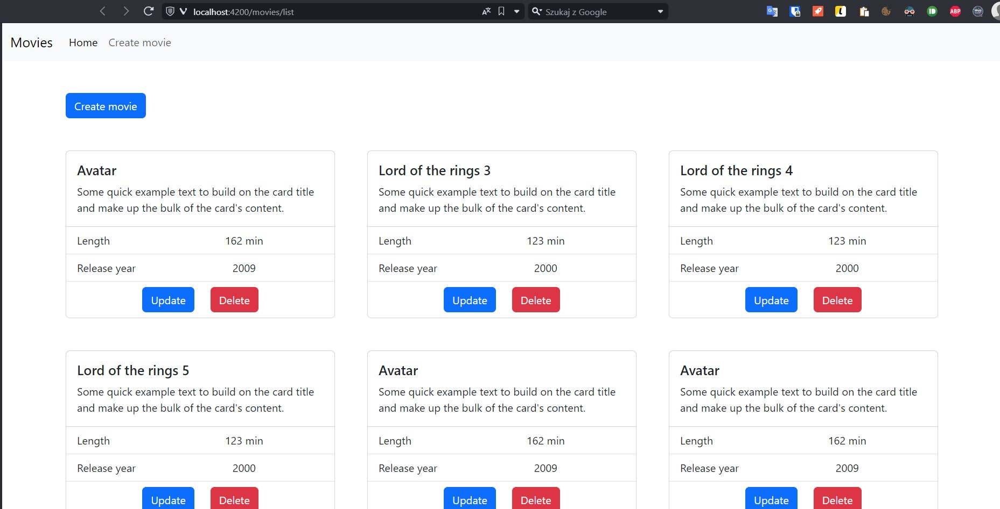

## Testy Selenium
Testy w Selenium zostały napisane w Javie w JUnit5.

Przetestowałem:
- przechodzenie do innych stron w pasku nawigacyjnym,
- dodawanie filmu,
- zablokowanie możliwości dodania filmu w przypadku błędnych danych,
- aktualizacja filmu,
- usuwanie filmu.

Podczas wykonywania testów napotkałem na błąd, polegający na tym, że w momencie otwierania przeglądarki przechodziła ona pod adres 'Data;', co wydłużyło czas każdego testu o 20s. Jest to błąd producenta, który miał zostać naprawiony.

Ustaliłem kolejność wykonywania testów tak, aby najpierw wykonywało się dodawanie filmów, następnie aktualizowanie filmów, a na sam koniec usuwanie ich.

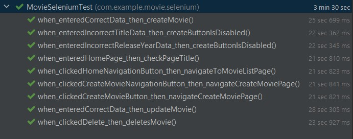

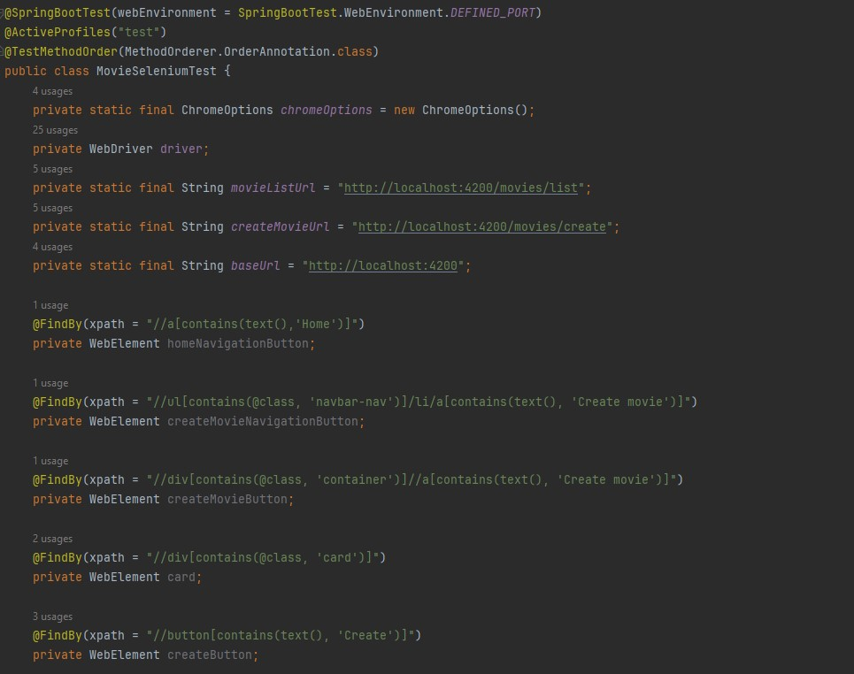
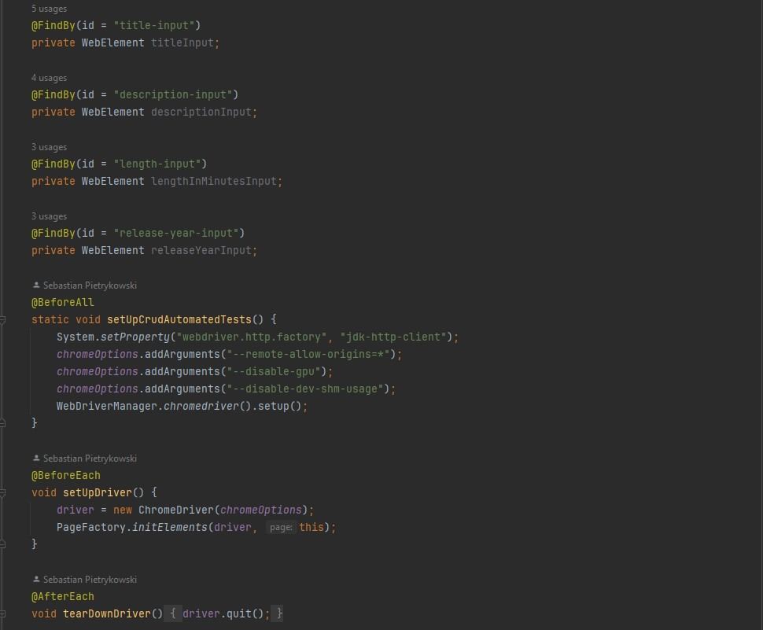
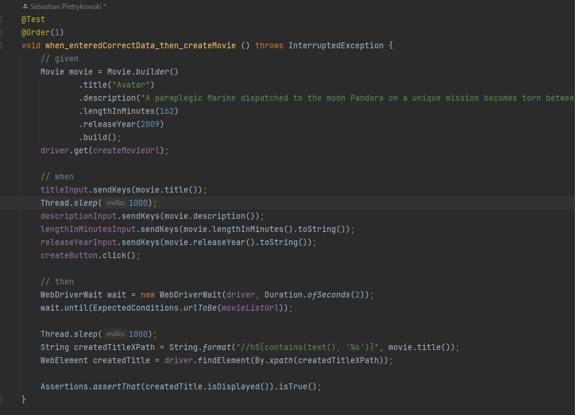
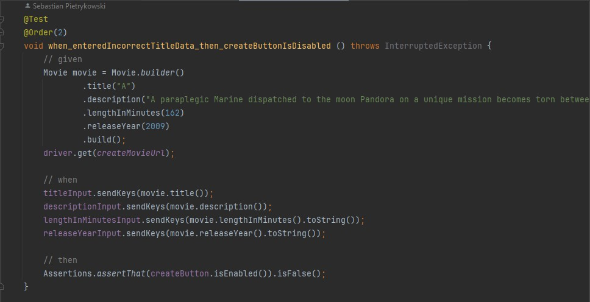
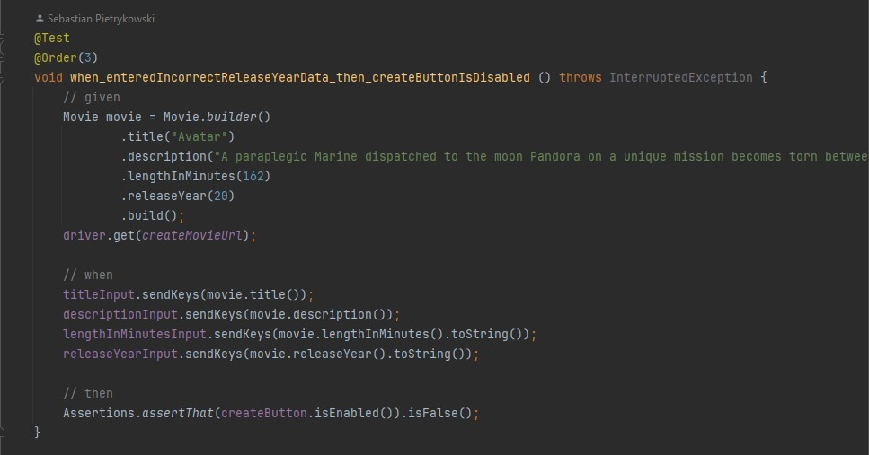
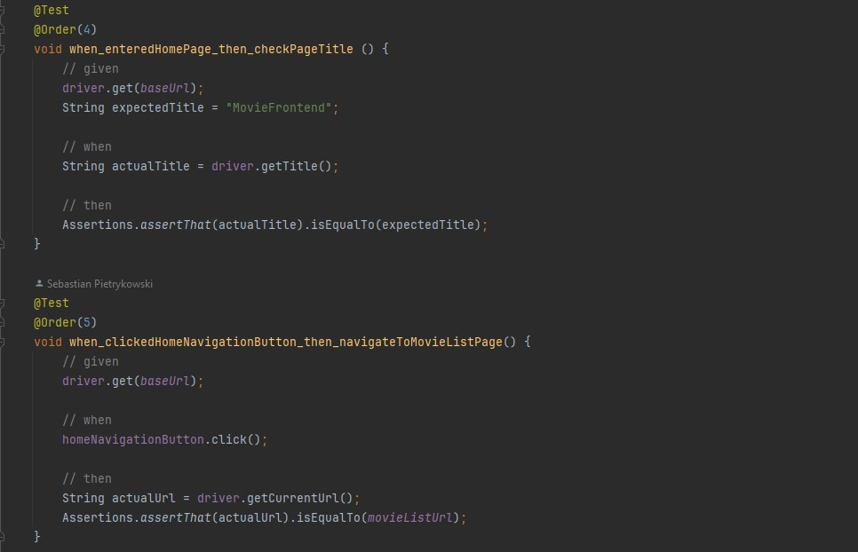
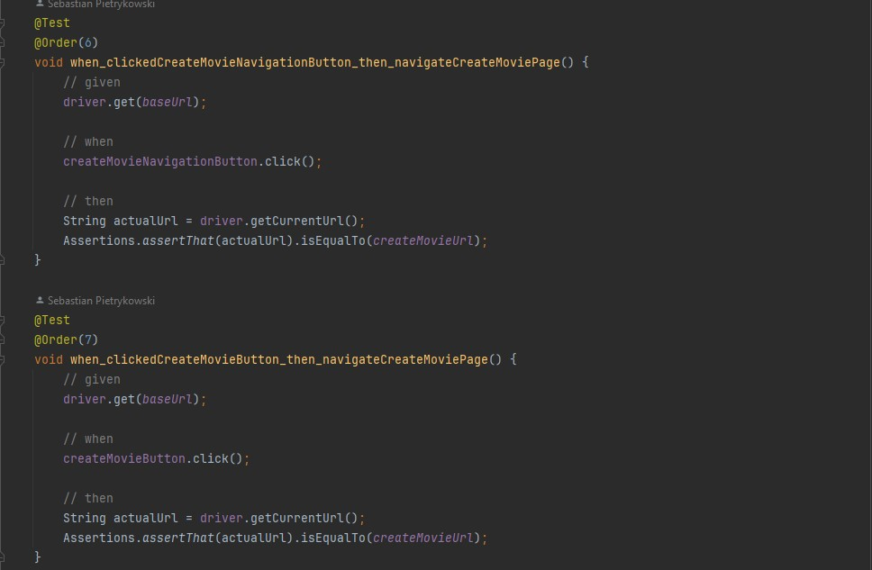
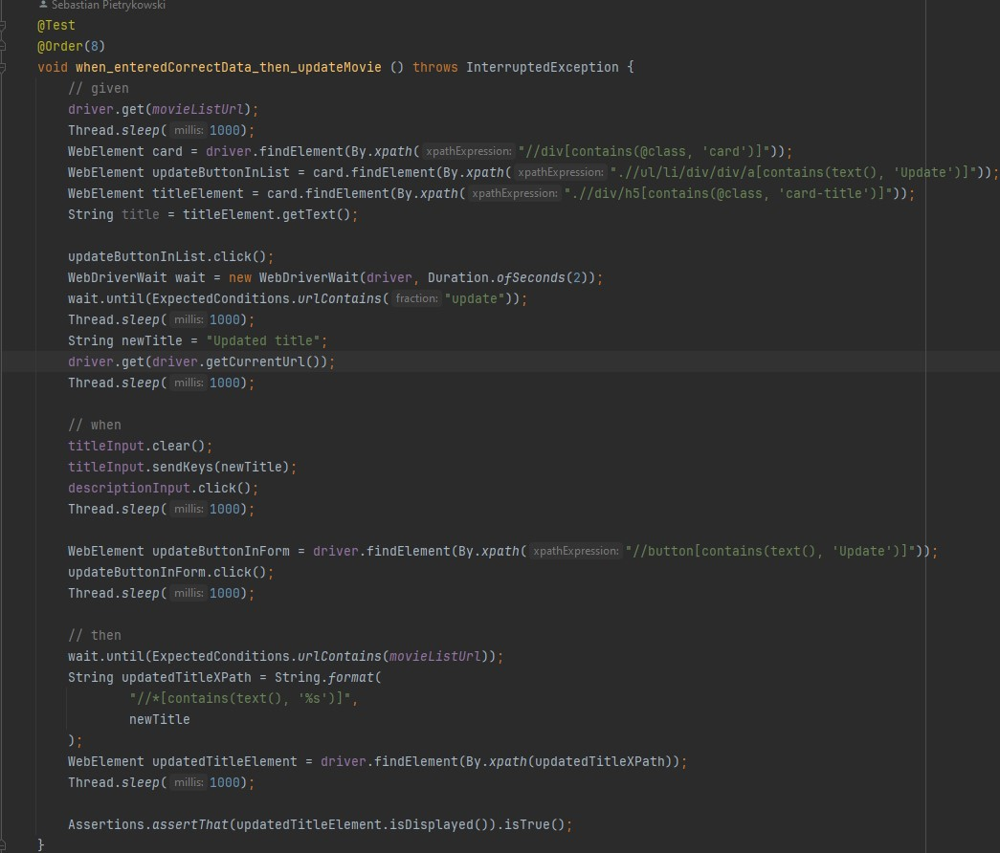
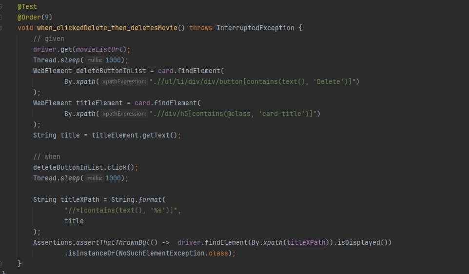

## Github Actions
Próbowałem ustawić testowanie oprogramowania na GitHubie dla nowych pull requestów, jednak po 10 próbach poddałem się. Problemem okazał się błąd:

"Error:    MovieSeleniumTest.setUpDriver:69 » AbstractMethod Receiver class org.openqa.selenium.chrome.ChromeDriverService$Builder does not define or inherit an implementation of the resolved method 'abstract void loadSystemProperties()' of abstract class org.openqa.selenium.remote.service.DriverService$Builder."

Jednakże konfiguracja, która nie chiała działać na Linuxie, działała bez problemu na Windowsie.

Moja konfiguracja najpierw uruchamia frontend w Angularze, następnie uruchamia testy w Javie, które uruchamiają backend w Javie.
Niemożliwe staje się pushowanie zmian na maina.

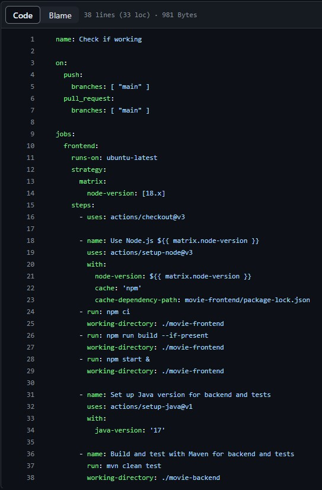
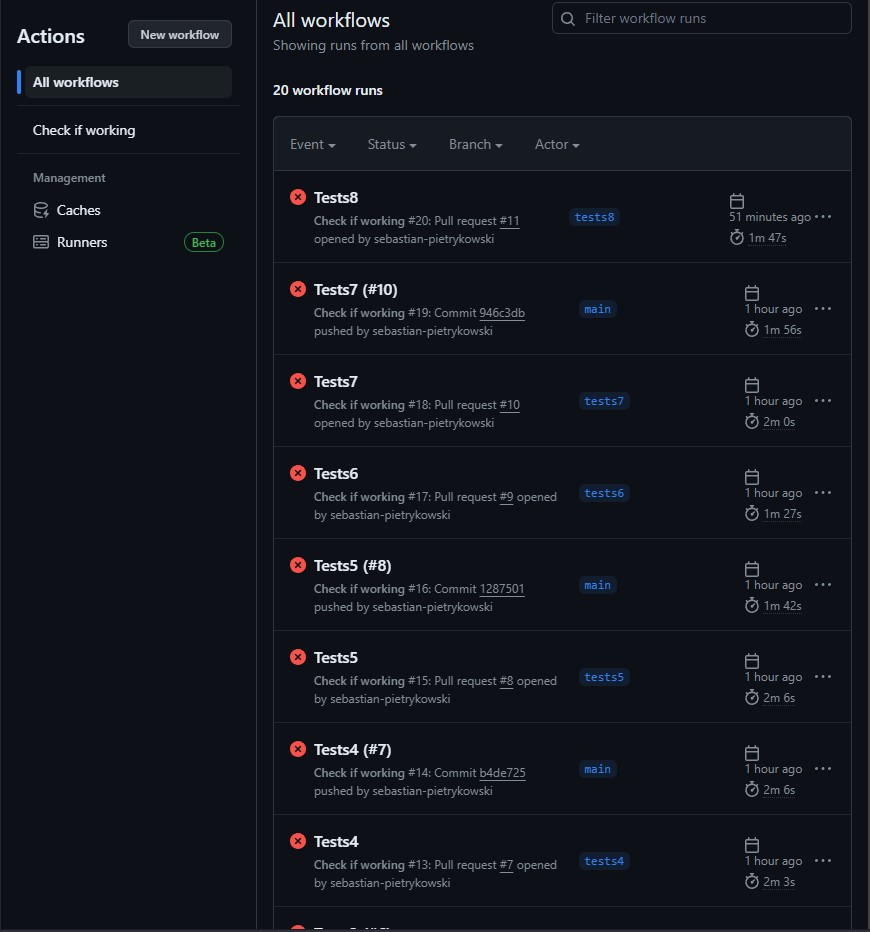

Na wykonanie pracy poświęciłem 9 godzin, co i tak nie pozwoliło mi na wykonanie nawet połowy założeń.